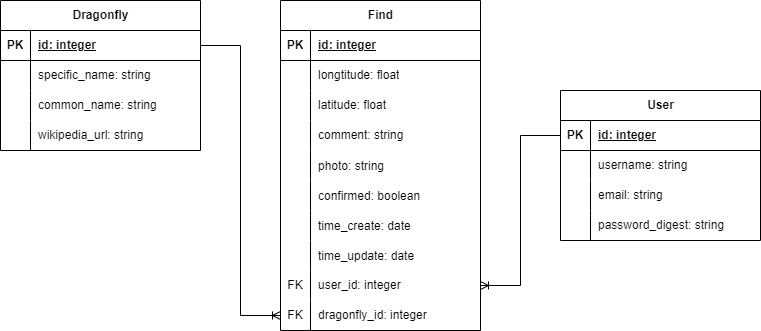

# Курсовая работа по ТРПС, 5 семестр

<p align="left">
  <a href="https://www.python.org/downloads/release/python-31012/"></a>
  <a href="https://blog.tensorflow.org/2022/09/whats-new-in-tensorflow-210.html"></a>
  <a href="https://pypi.org/project/opencv-python/4.8.0.74/"></a>
  <a href="LICENSE"></a>
</p>

В данном проекте реализуется веб-приложение, которое создает карту мест обитания различных видов стрекоз Москвы. Пользователь регистрируется или заходит в аккаунт, присылает фотографию стрекозы и указывает местоположение находки, а обученная модель предсказывает вид, автоматически на карте создается метка, в которой содержится фотография и информация о предсказанном виде. Если количество меток с одним видом становится достаточно большим в одной зоне, то они объединяются. Пользователь может просматривать все метки, созданные другими пользователями, а также удалять собственные.

Веб-приложение написано с помощью фреймворка Django. Бекэнд машинного обучения - Keras. Обучаемая модель последовательная (sequential). Данные для обучения, валидации и тестирования взяты с сервиса iNaturalist.

В ветке [`main`](https://github.com/sueta1995/CourseWork_TRPS/tree/main) находятся отчет *(название файла)*, техническовое задание *(название файла)*, документация *(название файла)*. В ветке [`machine_learing`](https://github.com/sueta1995/CourseWork_TRPS/tree/machine_learning) располагаются блокноты Jupyter Notebook с функциями для загрузки и подготовки данных для обучения и создания и обучения модели. В ветке [`web`](https://github.com/sueta1995/CourseWork_TRPS/tree/web) находится само веб-приложение.

## Этапы работы

Работа глобально разделена на две части: создание датасета из загруженных данных о стрекозах и создание и обучение модели на основе этих данных, создание веб-приложения.

- [x] **16.06.2023-20.06.2023** - *Загрузка данных с сервиса iNaturalist, анализ данных, создание из загруженных данных датасета.*
- [x] **16.07.2023-22.07.2023** - *Изучение существующих архитектур моделей, изучение сверточных нейронных сетей.*
- [x] **23.07.2023-28.07.2023** - *Написание кода модели, попытка обучения модели и ее тестирование на тестируемых данных, исследование использованных вариантов.*
- [ ] **29.07.2023-02.08.2023** - *Изучение фреймворка Django, повторение паттерна MVC, для создания веб-приложений.*
- [ ] **03.08.2023-06.08.2023** - *Создание главного меню и системы регистрации.*
- [ ] **09.08.2023-18.08.2023** - *Внедрение API карт в веб-приложение, реализация функции создания меток с найденными пользователями стрекозами, внедрение модели для предсказания вида.*
- [ ] **19.08.2023-20.08.2023** - *Тестирование первой версии созданной программы.*

~~А потом со слезами читать книгу про сети и готовиться к Тихомировой.~~

## Загрузка данных и создание датасета

Сначала с помощью сервиса [iNaturalist](https://www.inaturalist.org/observations/export) были загружены csv файлы, в которых содержатся датафреймы с двумя полями `scientific_name` и `image_url` (ссылка на файловый сервер с фотографией стрекозы) и которые соответствуют видам, обитающим в Москве. Данные о видах стрекоз, обитающих в Москве и МО, взяты из [проекта "Стрекозы Московской области/Dragonflies of the Moscow region (Russia)"](https://www.inaturalist.org/projects/strekozy-moskovskoy-oblasti-dragonflies-of-the-moscow-region-russia-815bf252-ee71-4519-840f-1620fd207bc5). Загружены данные для 64 видов.

Сначала был создан скрипт для загрузки фотографий с сервиса iNaturalist для каждого из 64 видов. Ниже представлен код для чтения всех файлов `observation-*.csv` и объединения их в один датафрейм Pandas.

```python
df_columns = ['image_url', 'scientific_name']
df = pd.DataFrame(columns=df_columns)

for filename in glob.glob(f"{path}\\*.csv"):
    temp_df = pd.read_csv(filename)
    df = pd.concat([df, temp_df], axis=0)
    
df.index = range(len(df))
```

После подготовки датафрейма были созданы директории для каждого вида стрекозы и загружены фотографии по полю `image_url` (код ниже, загрузка происходит с 96936-го элемента, так как при загрузке произошла ошибка, и выполнение программы прекратилось).

```python
sub_df = df.iloc[96935:]
sub_df

index = 96936

for raw in sub_df.iloc:
    try:
        filename = f"{index}.jpg"

        urllib.request.urlretrieve(raw['image_url'], filename)
        shutil.move(filename, f"\\mnt\\d\\odonata\\{raw['scientific_name']}")

        index += 1
    except Exception:
        continue
```

Проверка созданных директорий в ходе выполнения программы, код проверки представлен ниже.

```python
DATADIR = "/mnt/d/odonata"
CATEGORIES = os.listdir(DATADIR)

print(f"{len(CATEGORIES)}\n{CATEGORIES}")
```

Вывод:

```
64
['Aeshna affinis', 'Aeshna crenata', 'Aeshna cyanea', 'Aeshna grandis', 'Aeshna isoceles', 'Aeshna juncea', 'Aeshna mixta', 'Aeshna soneharai', 'Aeshna subarctica', 'Aeshna viridis', 'Anax imperator', 'Anax parthenope', 'Brachytron pratense', 'Calopteryx splendens', 'Calopteryx virgo', 'Coenagrion armatum', 'Coenagrion hastulatum', 'Coenagrion johanssoni', 'Coenagrion lunulatum', 'Coenagrion ornatum', 'Coenagrion puella', 'Coenagrion pulchellum', 'Cordulia aenea', 'Enallagma cyathigerum', 'Epitheca bimaculata', 'Erythromma najas', 'Erythromma viridulum', 'Gomphus vulgatissimus', 'Ischnura elegans', 'Ischnura pumilio', 'Lestes barbarus', 'Lestes dryas', 'Lestes sponsa', 'Lestes virens', 'Leucorrhinia albifrons', 'Leucorrhinia caudalis', 'Leucorrhinia dubia', 'Leucorrhinia pectoralis', 'Leucorrhinia rubicunda', 'Libellula depressa', 'Libellula fulva', 'Libellula quadrimaculata', 'Nehalennia speciosa', 'Onychogomphus forcipatus', 'Ophiogomphus cecilia', 'Orthetrum brunneum', 'Orthetrum cancellatum', 'Orthetrum coerulescens', 'Pantala flavescens', 'Platycnemis pennipes', 'Pyrrhosoma nymphula', 'Somatochlora arctica', 'Somatochlora flavomaculata', 'Somatochlora metallica', 'Stylurus flavipes', 'Sympecma fusca', 'Sympecma paedisca', 'Sympetrum danae', 'Sympetrum flaveolum', 'Sympetrum fonscolombii', 'Sympetrum pedemontanum', 'Sympetrum sanguineum', 'Sympetrum striolatum', 'Sympetrum vulgatum']
```

Из вывода понятно, что все директории созданы верно, а их количество соответствует общему количеству видов стрекоз, которые рассматриваются в рамках проекта. Теперь необходимо проверить правильность загрузки фотографий, код этой проверки представлен ниже.

```python
check = []

for category in CATEGORIES:
    check.append((category, len(os.listdir(os.path.join(DATADIR, category)))))

print(check)
```

Вывод проверки:

```
[('Aeshna affinis', 947), ('Aeshna crenata', 276), ('Aeshna cyanea', 4717), ('Aeshna grandis', 2239), ('Aeshna isoceles', 1510), ('Aeshna juncea', 2233), ('Aeshna mixta', 4545), ('Aeshna soneharai', 426), ('Aeshna subarctica', 462), ('Aeshna viridis', 258), ('Anax imperator', 3808), ('Anax parthenope', 2016), ('Brachytron pratense', 1018), ('Calopteryx splendens', 6878), ('Calopteryx virgo', 4116), ('Coenagrion armatum', 317), ('Coenagrion hastulatum', 1687), ('Coenagrion johanssoni', 366), ('Coenagrion lunulatum', 266), ('Coenagrion ornatum', 79), ('Coenagrion puella', 6972), ('Coenagrion pulchellum', 3514), ('Cordulia aenea', 2143), ('Enallagma cyathigerum', 6316), ('Epitheca bimaculata', 667), ('Erythromma najas', 3220), ('Erythromma viridulum', 2127), ('Gomphus vulgatissimus', 2440), ('Ischnura elegans', 5329), ('Ischnura pumilio', 1146), ('Lestes barbarus', 1372), ('Lestes dryas', 3252), ('Lestes sponsa', 2903), ('Lestes virens', 1303), ('Leucorrhinia albifrons', 456), ('Leucorrhinia caudalis', 341), ('Leucorrhinia dubia', 980), ('Leucorrhinia pectoralis', 761), ('Leucorrhinia rubicunda', 1281), ('Libellula depressa', 3896), ('Libellula fulva', 3601), ('Libellula quadrimaculata', 4790), ('Nehalennia speciosa', 190), ('Onychogomphus forcipatus', 3332), ('Ophiogomphus cecilia', 817), ('Orthetrum brunneum', 2961), ('Orthetrum cancellatum', 4121), ('Orthetrum coerulescens', 3634), ('Pantala flavescens', 4015), ('Platycnemis pennipes', 4013), ('Pyrrhosoma nymphula', 4359), ('Somatochlora arctica', 182), ('Somatochlora flavomaculata', 582), ('Somatochlora metallica', 868), ('Stylurus flavipes', 313), ('Sympecma fusca', 3577), ('Sympecma paedisca', 1938), ('Sympetrum danae', 3576), ('Sympetrum flaveolum', 3307), ('Sympetrum fonscolombii', 3987), ('Sympetrum pedemontanum', 1577), ('Sympetrum sanguineum', 6955), ('Sympetrum striolatum', 3880), ('Sympetrum vulgatum', 4333)]
```

Для каждого из видов фотографии загружены верно. Теперь можно переходить к подготовке этих загруженных данных для обучения и созданию модели.

Весь код, отвечающий за загрузку данных и создание датасета, располагается в [`classification/load_photos.ipynb`](https://github.com/sueta1995/CourseWork_TRPS/blob/machine_learning/classification/load_photos.ipynb).

## Подготовка данных для обучения модели

Основная проблема при подготовке данных для обучения - сильная их неравномерность. Например, количество фотографий для вида *Coenagarion lumalatum* (стрелка весенняя) - 79, а для вида *Aeshna cyanea* (коромысло синее, ~~мой самый любимый вид~~) - 4717. Для наиболее качественного обучение необходимо, чтобы данные были равномерно распределены, то есть для каждого из видов. Поэтому было принято решение не брать в рассмотрение редкие виды стрекоз, для которых количество фотографий меньше 1000. 

Код, который реализует это, представлен ниже.

```python
DATADIR = "/mnt/d/odonata"
CATEGORIES = np.array(os.listdir(DATADIR))

CATEGORIES = np.fromiter(
    (category for category in CATEGORIES if len(os.listdir(os.path.join(DATADIR, category))) > 1000),
    dtype = CATEGORIES.dtype
)

print(len(CATEGORIES))
```

Вывод:

```
44
```

Это означает, что будущая модель будет обучаться на основе 44 классов, в каждом из которых по 1000 данных для обучения и валидации.

Далее необходимо распределить данные на данные для тренировки и данные для валидации, разместить это все в отдельном каталоге. В каждом классе будет 900 фотографий для тренировки и 100 фотографий для валидации.

Код, который реализует разделение данных для тренировки, представлен ниже.

```python
def create_training_data():
    for category in CATEGORIES:
        path = os.path.join(DATADIR, category)
        dst_path = f"/mnt/d/odonata_data/train_data/{category}"
        
        os.mkdir(dst_path)
        
        for _ in tqdm(range(900)):
            try:
                img_path = os.path.join(path, os.listdir(path)[_])
                
                shutil.copy(img_path, dst_path)
            except Exception as e:
                pass
```

И код для разделения данных для валидации:

```python
def create_validation_data():
    for category in CATEGORIES:
        path = os.path.join(DATADIR, category)
        dst_path = f"/mnt/d/odonata_data/valid_data/{category}"
        
        os.mkdir(dst_path)
        
        for _ in tqdm(range(900, 1000)):
            try:
                img_path = os.path.join(path, os.listdir(path)[_])
                
                shutil.copy(img_path, dst_path)
            except Exception as e:
                pass
```

Библиотека `tqdm` необходима для того, чтобы отслеживать каждую итерацию во вложенном цикле.

После вызова функций `create_training_data` и `create_validation_data` были созданы директории `train_data` и `valid_data` соответственно, и в каждой из них находились по 44 папки, соответствующие всем классам. В каждой директории внутри `train_data` находилось 900 фотографий, внутри `valid_data` - 100.

Весь код, отвечающий за подготовку данных для обучения модели, располагается в [`classification/odonata_data.ipynb`](https://github.com/sueta1995/CourseWork_TRPS/blob/machine_learning/classification/odonata_data.ipynb).

## Создание модели и ее обучение

Входные данные у модели имеют следующий размер: 224 пикселей в высоту(`IMG_SIZE`), 224 пикселей в ширину (`IMG_SIZE`) и 3 канала RGB (`CHANNELS`). Количество эпох - 200 (`EPOCHS`). Размер пакета - 128 (`BATCH_SIZE`). Ниже представлен код, описывающий глобальные переменные.

```python
IMG_SIZE = 224
CHANNELS = 3
TRAIN_DIR = '/mnt/d/odonata_data/train_data'
VALID_DIR = '/mnt/d/odonata_data/valid_data'
EPOCHS = 200
BATCH_SIZE = 128
```

Так как данных для обучения не так много, они будут дополнены новыми с помощью вращения, сдвигом по ширине и высоте, зумом, затемнением. Код представлен ниже.

```python
train_datagen = ImageDataGenerator(
    rescale=1./255,
    rotation_range=10,
    width_shift_range=0.1,
    height_shift_range=0.1,
    shear_range=0.1,
    zoom_range=0.1,
    brightness_range=[0.15,2.0],
    horizontal_flip=True
)

valid_datagen = ImageDataGenerator(
    rescale=1./255.
)
```

Далее нужно изменить размер входных изображений и перемешать их. Код, в котором это происходит, представлен ниже.

```python
train_generator = train_datagen.flow_from_directory(
    TRAIN_DIR,
    target_size=(IMG_SIZE, IMG_SIZE),
    color_mode='rgb',
    batch_size=32,
    seed=1,
    shuffle=True,
    class_mode='categorical'
)

valid_generator = valid_datagen.flow_from_directory(
    VALID_DIR,
    target_size=(IMG_SIZE, IMG_SIZE),
    color_mode='rgb',
    batch_size=32,
    seed=7,
    shuffle=True,
    class_mode='categorical'
)

train_num = train_generator.samples
valid_num = valid_generator.samples
```

Вывод:

```
Found 39600 images belonging to 44 classes.
Found 4400 images belonging to 44 classes.
```

Это означает, что изображения успешно загружены и привязаны к 44 классам, которые соответствуют 44 рассматриваемым в рамках обучения видам.

Далее необходимо создать модель. Поскольку машина, на которой будет происходить обучение не слишком мощная, причем видеокарта от производителя AMD (это вынуждает использовать UNIX-подобную систему), то выбор архитектуры модели пал на последовательную. В модели 8 слоев. 

Код, в котором описаны все слои модели, представлен ниже.

```python
model = Sequential()

model.add(Conv2D(filters=96, kernel_size=(11, 11),
                 strides=(4, 4), activation="relu",
                 input_shape=(IMG_SIZE, IMG_SIZE, CHANNELS)))
model.add(BatchNormalization())
model.add(MaxPool2D(pool_size=(3, 3), strides= (2, 2)))
model.add(Conv2D(filters=256, kernel_size=(5, 5),
                 strides=(1, 1), activation="relu",
                 padding="same"))
model.add(BatchNormalization())
model.add(MaxPool2D(pool_size=(3, 3), strides=(2, 2)))
model.add(Conv2D(filters=384, kernel_size=(3, 3),
                 strides=(1, 1), activation="relu",
                 padding="same"))
model.add(BatchNormalization())
model.add(Conv2D(filters=384, kernel_size=(3, 3),
                 strides=(1, 1), activation="relu",
                 padding="same"))
model.add(BatchNormalization())
model.add(Conv2D(filters=256, kernel_size=(3, 3),
                 strides=(1, 1), activation="relu",
                 padding="same"))
model.add(BatchNormalization())
model.add(MaxPool2D(pool_size=(3, 3), strides=(2, 2)))
model.add(Flatten())
model.add(Dense(4096, activation="relu"))
model.add(Dropout(0.5))
model.add(Dense(44, activation="softmax"))

model.compile(loss='categorical_crossentropy',
              optimizer=SGD(learning_rate=0.001),
              metrics=['accuracy'])

model.summary()
```

Ниже представлено описание модели:

```
Model: "sequential_4"
_________________________________________________________________
 Layer (type)                Output Shape              Param #   
=================================================================
 conv2d_16 (Conv2D)          (None, 54, 54, 96)        34944     
                                                                 
 batch_normalization_15 (Bat  (None, 54, 54, 96)       384       
 chNormalization)                                                
                                                                 
 max_pooling2d_9 (MaxPooling  (None, 26, 26, 96)       0         
 2D)                                                             
                                                                 
 conv2d_17 (Conv2D)          (None, 26, 26, 256)       614656    
                                                                 
 batch_normalization_16 (Bat  (None, 26, 26, 256)      1024      
 chNormalization)                                                
                                                                 
 max_pooling2d_10 (MaxPoolin  (None, 12, 12, 256)      0         
 g2D)                                                            
                                                                 
 conv2d_18 (Conv2D)          (None, 12, 12, 384)       885120    
                                                                 
 batch_normalization_17 (Bat  (None, 12, 12, 384)      1536      
 chNormalization)                                                
                                                                 
 conv2d_19 (Conv2D)          (None, 12, 12, 384)       1327488   
                                                                 
 batch_normalization_18 (Bat  (None, 12, 12, 384)      1536      
 chNormalization)                                                
                                                                 
 conv2d_20 (Conv2D)          (None, 12, 12, 256)       884992    
                                                                 
 batch_normalization_19 (Bat  (None, 12, 12, 256)      1024      
 chNormalization)                                                
                                                                 
 max_pooling2d_11 (MaxPoolin  (None, 5, 5, 256)        0         
 g2D)                                                            
                                                                 
 flatten_3 (Flatten)         (None, 6400)              0         
                                                                 
 dense_6 (Dense)             (None, 4096)              26218496  
                                                                 
 dropout_3 (Dropout)         (None, 4096)              0         
                                                                 
 dense_7 (Dense)             (None, 44)                180268    
                                                                 
=================================================================
Total params: 30,151,468
Trainable params: 30,148,716
Non-trainable params: 2,752
_________________________________________________________________
```

Визуальное представление архитектуры модели:


Расшифровка картинки:

<table>
  <tr>
    <th>Цвет</th>
    <th>Обозначение</th>
  </tr>
  <tr>
    <td>Желтый</td>
    <td>Слой Conv2D</td>
  </tr>
  <tr>
    <td>Красный</td>
    <td>Слой BatchNormalization</td>
  </tr>
  <tr>
    <td>Бирюзовый</td>
    <td>Слой MaxPooling2D</td>
  </tr>
  <tr>
    <td>Синий</td>
    <td>Слой Flatten</td>
  </tr>
  <tr>
    <td>Темно-синий</td>
    <td>Слой Dropout</td>
  </tr>
</table>

После необходимо обучить модель, используются параметры `EPOCHS` и `BATCH_SIZE`, которые были объявлены раньше. Код, вызывающий функцию обучения, представлен ниже.

```python
history = model.fit(
    train_generator,
#     steps_per_epoch=train_num // BATCH_SIZE,
    validation_data=valid_generator,
#     validation_steps=valid_num // BATCH_SIZE,
    batch_size=BATCH_SIZE,
    epochs=EPOCHS,
    verbose=1
)
```

Обучение заняло около 25 часов, и точность на тестируемом наборе данных составляет 59%. Это одна из первых архитектур модели, используемой в рамках классификации видов стрекоз. В будущем эта модель будет улучшаться и усложняться.

Ниже представлены графики для истории потерь и истории точности для каждой из 200 эпох обучения.


Код, отвечающий за создание блока из двух вышепредставленных графиков:

```python
fig, axes = plt.subplots(nrows=1, ncols=2)

# Plot history: Loss
axes[0].plot(history.history['val_loss'])
axes[0].set_title('Validation loss history')
axes[0].set_ylabel('Loss value')
axes[0].set_xlabel('No. epoch')

# Plot history: accuracy
axes[1].plot(history.history['val_accuracy'])
axes[1].set_title('Validation accuracy history')
axes[1].set_ylabel('Accuracy value (%)')
axes[1].set_xlabel('No. epoch')

fig.suptitle('Model history')
plt.tight_layout()
fig.savefig('/mnt/d/history_model.png', bbox_inches='tight')
```

Второй вариант модели - ResNet50, с 50 слоями. Графическое представление модели:


Ниже представлен код, отвечающий за создание модели типа ResNet50, теперь количесво эпох равно 40, `BATCH_SIZE` равно 256.

```python
model = tf.keras.applications.resnet.ResNet50(
    include_top=True,
    weights=None,
    input_tensor=None,
    input_shape=(IMG_SIZE, IMG_SIZE, CHANNELS),
    pooling=None,
    classes=44,
)

model.compile(loss='categorical_crossentropy',
              optimizer=SGD(),
              metrics=['accuracy'])

model.summary()
```

Обучение заняло гораздо меньше времени (примерно 4 часа), чем у первого варианта, что связано c архитектурой модели (быстрых связей). Точность на валидационных данных составила 65%.

Ниже представлена графически история обучения модели:


Третий вариант модели - EffiecientNetB0. Графическое представление модели:


Обучение производилось на протяжении 20 эпох, был использованы собственные верхние слои для модели: `GlobalAvaragePooling`, `BatchNormalization` и `DropOut` с параметром `0.5`. Само обучение по времени заняло 20 часов, точность на валидационном наборе данных составила 35%. Однако при проверке на тестирующем наборе данных присутствовал эффект переобучения, и модель неправильно предсказывала виды.

Код модели аналогичен ResNet50, только параметр `include_top` теперь `False`. 

Ниже представлена графически история обучения модели:


Весь код, отвечающий за создание и обучение модели, располагается в [`classification/odonata_model.ipynb`](https://github.com/sueta1995/CourseWork_TRPS/blob/machine_learning/classification/odonata_model.ipynb).

## Главное меню приложения и система регистрации

Веб-приложение глобально разделено на три составляющие: регистрация и авторизация, лист последних меток на карте, сама карта мест обитания стрекоз. 

Для реализации веб-приложения будет использоваться база данных со следующими сущностями:

***Dragonfly***

<table>
  <tr>
    <th>Название поля</th>
    <th>Назначение поля</th>
    <th>Тип данных</th>
  </tr>
  <tr>
    <td>id</td>
    <td>Уникальный идентификатор вида</td>
    <td>Integer</td>
  </tr>
  <tr>
    <td>specific_name</td>
    <td>Латинское название вида</td>
    <td>String</td>
  </tr>
  <tr>
    <td>common_name</td>
    <td>Русское название вида</td>
    <td>String</td>
  </tr>
  <tr>
    <td>wikipedia_url</td>
    <td>Ссылка на статью wikipedia о данном виде</td>
    <td>String</td>
  </tr>
</table>

***User***

<table>
  <tr>
    <th>Название поля</th>
    <th>Назначение поля</th>
    <th>Тип данных</th>
  </tr>
  <tr>
    <td>id</td>
    <td>Уникальный идентификатор пользователя</td>
    <td>Integer</td>
  </tr>
  <tr>
    <td>username</td>
    <td>Имя пользователя</td>
    <td>String</td>
  </tr>
  <tr>
    <td>email</td>
    <td>Электронный почтовый адрес пользователя</td>
    <td>String</td>
  </tr>
  <tr>
    <td>password_digest</td>
    <td>Пароль пользователя в зашифрованном виде</td>
    <td>String</td>
  </tr>
</table>

***Find***

<table>
  <tr>
    <th>Название поля</th>
    <th>Назначение поля</th>
    <th>Тип данных</th>
  </tr>
  <tr>
    <td>id</td>
    <td>Уникальный идентификатор находки</td>
    <td>Integer</td>
  </tr>
  <tr>
    <td>longitude</td>
    <td>Долгота координаты находки</td>
    <td>Float</td>
  </tr>
  <tr>
    <td>latitude</td>
    <td>Широта координаты находки</td>
    <td>Float</td>
  </tr>
  <tr>
    <td>comment</td>
    <td>Комментарий к находке</td>
    <td>String</td>
  </tr>
  <tr>
    <td>time_create</td>
    <td>Время добавления находки на карту</td>
    <td>Date</td>
  </tr>
  <tr>
    <td>time_create</td>
    <td>Время обновления информации о находке</td>
    <td>Date</td>
  </tr>
  <tr>
    <td>photo</td>
    <td>Фотография находки</td>
    <td>String</td>
  </tr>
  <tr>
    <td>confirmed</td>
    <td>Подтверждена ли находка</td>
    <td>Boolean</td>
  </tr>
  <tr>
    <td>user_id</td>
    <td>Указатель на пользователя, который добавил находку</td>
    <td>Integer</td>
  </tr>
  <tr>
    <td>dragonfly_id</td>
    <td>Указатель на вид стрекозы, к которому относится находка</td>
    <td>Integer</td>
  </tr>
</table>

Визуальное представление базы данных:



Данная база данных является неокончательной и может измениться в будущих версиях.

На данном этапе будет проектироваться и реализовываться система регистрации и главное меню. Главное меню в рамках проекта - лист последних находок и шапка сайта с переходами на страницы карты и регистрации.

## Функция создания меток со стрекозами
